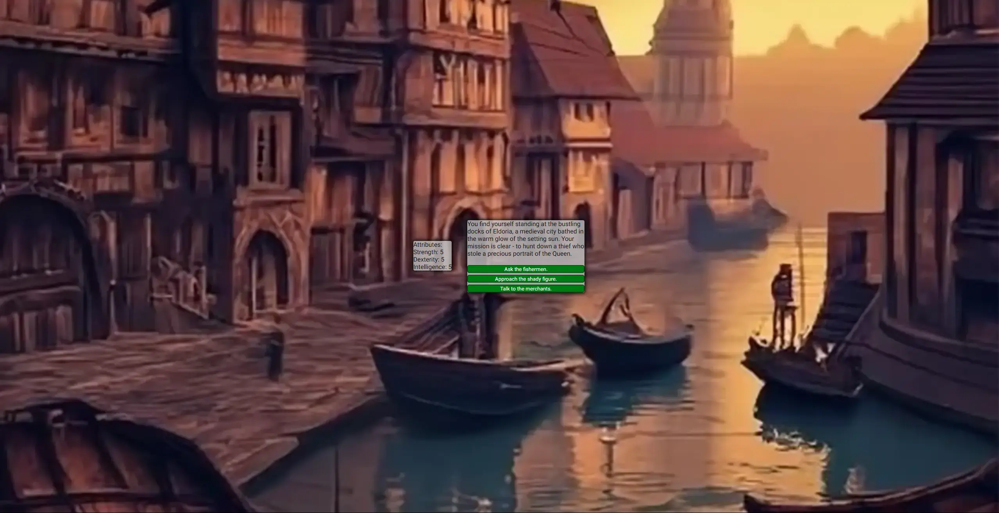

### Shadows at the Docks 1
## A Text-based RPG Adventure in a Highfantasy world.

"You find yourself standing at the bustling docks of Eldoria, a medieval city bathed in the warm glow of the setting sun. The salty sea breeze fills the air as ships bob gently in the harbor. Your mission is clear - to hunt down a thief who stole a precious portrait of the Queen." 
This is the first Chapter of an nameless Hero and his Adventures to save the World.... or destroy it. Every Step you do you can decide what you want to do next. With three Attributes you can overcome different challenges. Sometimes you will fail. Sometimes don't choose the Option, which works best for you and your approach.

## List of Features
<ol>
<li>Three different Choices every Step you take.</li>
<li>Three Attributes: "Strength, Dexterity, Intellect" every one of them can be increased</li>
<li>Newly created Favicon</li>
</ol>

## Look of the Page

The Website just contains on page for the game itself. Focusing on the Javascript code.

The Website contains a Favicon with his title.

## Troubleshooting

I faced two major problems while creating, the game. The first was to create the nonlinear progress of the game due to the different choices the user has. 
My first intention was to handle this problem with a switch - case function.
"function handleStep1(choice) {
            switch (choice) {
                case 1:
                    strength += 2;
                    updateAttributes();
                    updateStory("You ask the dock workers for information. They point to a hooded figure near the shipyard.");
                    currentStep = 2;
                    updateButtonLabels(choiceTexts[currentStep - 1]);
                    break;

                case 2:
                    intelligence += 2;
                    updateAttributes();
                    updateStory("You investigate the crime scene, finding magical residue hinting at a mystical involvement.");
                    currentStep = 2;
                    updateButtonLabels(choiceTexts[currentStep - 1]);
                    break;

                case 3:
                    updateAttributes();
                    updateStory("You visit the tavern to gather information from the local patrons.");
                    currentStep = 2;
                    updateButtonLabels(choiceTexts[currentStep - 1]);
                    break;
                    
                default:
                    updateStory("Invalid choice. Try again.");
                    break;
            }
        }"

I tried several different cases in mutlitple Functions, which led to the conclusion
that this way I could not manage to keep the game nonlinear and it just allowed me to prepare a few possible paths. 
With the Functions I use in the newest deployment, I am able to do the whole game completely nonlinear.
The second problem was how to handle the attribute and to update the correct value by certain choices of the array. The solution I first came up with was, to target this problem with If /Else statements. This did not work for the nonlinear gameplay, because the game jumps depending on the choices back to a earlier stage of the game. To prevent exploiting, some choices, I needed to create functions, which support my nonlinear gameplay, and can be called by the same function as the choicemaking function.

## Testing

# Function
All Choices were tested for functionality accesibility if they work and every possible way of decision has been tested out.
Example:
<ol>
  <li>Ask the Fishermen</li>
  <li>Talk to the Merchants</li>
  <li>Look for the shady figure</li>
  <li>Grab his arm and demand information</li>
    <ol>
        <li>Calm the shady person and offer him payment for information (Continues this Storypath)</li>
        <li>Try to run from the guards (Leads to an Game Over)</li>
        <li>Explain everything to the guards (Leads to an Game Over)</li>
    </ol>
  <li>Lockpick the closed door</li>
  <li>Introduce yourself and explain the situation</li>
  <li>Continue</li>
</ol>
There are multiple ways to get through all 24 Steps in the game.
Problems encountered: 
<ul>
<li>Multiple Choices did not lead to the right description.</li>
<li>The Attributes did not increase as expected.</li>
</ul>

Solutions:
Used the Console.log for checking if the function is called as intended
Checked through the objects in the different Arrays and changed the values.

# Responsiveness
The page were tested to ensure responsiveness on screen sizes from 320px and upwards responsive design on Chrome, Edge, Firefox and Opera browsers.

Steps to test:
<ol>
<li>Open browser and navigate to Shadows at the docks:</li>
<li>Open the developer tools (right click and inspect)</li>
<li>Set to responsive and decrease width to 320px</li>
<li>Set the zoom to 50%</li>
<li>Click and drag the responsive window to maximum width</li>
</ol>
Expected:
Website is responsive on all screen sizes and no images are pixelated or stretched. No horizontal scroll is present. No elements overlap.

Actual:
Website behaved as expected

# Accesibility

To ensure being on the standards of Accesibility I used the Lighthousetool for testing the accesibility of the Website:
For Desktop:

And Mobile Device:

Problems encountered:
Low SEO rating for the website, due to no description and keywords in the HTML Head.

Solution:
Added a description with fitting keywords for SEO.

# Validating

The html code was tested for validation via. w3c validator and no errors were found except for some typo mistakes like a space to much or stray tags. I corrected these and in the end there were no mistakes found.  

The css Code was tested via jigsaw w3c there were no errors found for the code:  

  
## Sources

<ul>
<li><a href="https://pythontutor.com/javascript.html#mode=edit/" target="_blank" rel="noopener">Assistance tool for Javascript code</a></li>
<li><a href="https://validator.w3.org/" target="_blank" rel="noopener">Validator for my HTML5 code</a></li>
<li><a href="https://jigsaw.w3.org/css-validator/" target="_blank" rel="noopener">Validator for my css code</a></li>
<li><a href="https://jshint.com/" target="_blank" rel="noopener">Assistant to clean up Javascript code</a></li>
</ul>

## Technologies used

<ul>
<li>Googlefonts: <a href="https://fonts.google.com/" target="_blank" rel="noopener"> Google fonts </a> </li>
<li>Tinypng to compress my Webp images: <a href="https://tinypng.com" target="_blank" rel="noopener"> Tinypng </a> </li>
<li>Cloudconvert to convert my .png and .jpeg files: <a href="https://cloudconvert.com/jpeg-to-webp" target="_blank" rel="noopener"> Cloudconvert </a> </li>
<li>Favicon converter for the Favicon Icon: <a href="https://favicon.io/favicon-converter/" target="_blank" rel="noopener"> Favicon converter </a> </li>
<li>Website for the Mockup Image: <a href="https://techsini.com/multi-mockup/" target="_blank" rel="noopener">Techsini</a></li>
<li>Tinyurl to shorten long Urls: <a href="https://tinyurl.com/app" target="_blank" rel="noopener">TinyUrl</a></li>
<li>Photshop for my Backgroundpicture</li>
<li>Tutorial from Stackflow for implementing Backgroundmusic on a Webpage: <a href="https://stackoverflow.com/questions/6529645/how-to-add-background-music-to-a-web-page" target="_blank" rel="noopener">Stackflow</a></li>
</ul>
